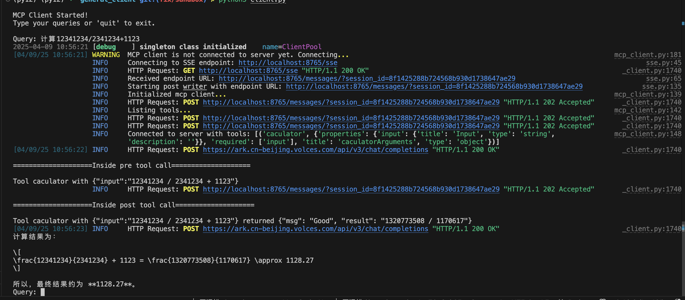

# General MCP client

## Introduction

A basic implementation of a MCP client working with one mcp server

## Prerequisites

Python >=3.10,<3.12

```
pip install -r requirement.txt
```

## Quick Start

1. start a calculator MCP server

```bash
ARK_API_KEY=<YOUR API KEY> ARK_TOOL_CACULATOR=true PORT=8765 uvx --from git+https://github.com/volcengine/mcp-server.git#subdirectory=server/mcp_server_ark mcp-server-ark --transport sse
```

2. set up environment variable

   ``` bash
   export ARK_API_KEY=<YOUR API KEY>
   ```

3. start your client

   ```bash
   python3 client.py
   ```

4. run test query and see your output
   1. example query to trigger calculator: 计算12341234/2341234+1123

