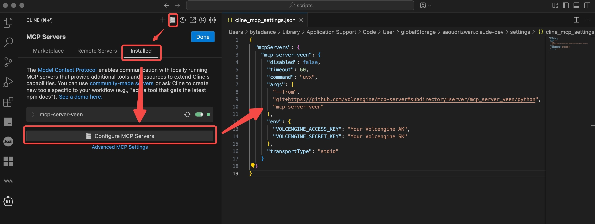

# 边缘计算节点 MCP Server

## 版本信息

v0.1

## 产品描述

### 短描述

申请、配置、查阅在边缘计算节点，包括虚拟机、镜像、裸金属，及对应的网络配置。

### 长描述

火山引擎边缘计算节点基于覆盖中国内地各省份和运营商的边缘节点，提供弹性、可靠、分布式的算力资源和低时延的网络资源，为用户就近提供计算、网络、存储等资源，帮助用户将业务快速部署到网络边缘，提升响应速度、降低带宽成本。

边缘计算节点提供不同粒度的算力服务，满足多样化场景中的用户需求。包含边缘计算节点、边缘容器、边缘托管和边缘函数等子产品。

## 分类

CDN与边缘

## 标签

边缘云，虚拟机，镜像，存储

## Tools

本 MCP Server 产品提供以下 Tools (工具/能力):

### Tool 1: get_cloud_server

根据边缘服务的 ID 获取边缘服务的详细信息。

### Tool 2: start_instances

根据边缘实例 ID 启动实例。

### Tool 3: get_instance

根据边缘实例 ID 获取实例详细信息。

### Tool 4: list_instances

列出指定的边缘服务或所有边缘服务下的边缘实例。

### Tool 5: get_image

获取容器镜像详情。

### Tool 6: list_instance_internal_ips

获取边缘实例的私网 IP 地址的列表。

### Tool 7: list_instance_types

获取边缘服务下可开通的实例规格。

## 可适配平台

- Python
- Node.js

## 服务开通链接

需要先为火山引擎账号开通边缘计算节点服务。

https://console.volcengine.com/edge/veen

## 鉴权方式

AK&amp;SK

### 获取 AK&amp;SK

从[火山引擎控制台](https://console.volcengine.com/iam/identitymanage/user)获取 Access Key ID 和 Secret Access Key。

注：此 Access Key ID 和 Secret Access Key 须具有相关 OpenAPIs 访问权限。

### 环境变量配置

| 变量名 | 值 |
| ---------- | ---------- |
| `VOLCENGINE_ACCESS_KEY` | 火山引擎账号 Access Key ID |
| `VOLCENGINE_SECRET_KEY` | 火山引擎账号 Secret Access Key |

## Python 版 MCP server

### 依赖项

运行 MCP server 的设备需要安装以下依赖项。

- [Python](https://www.python.org/downloads/) 3.11 或更高版本。
- [`uv`](https://docs.astral.sh/uv/) &amp; [`uvx`](https://docs.astral.sh/uv/guides/tools/)。
- 对于 Windows 操作系统，还需要参考 [PyCryptodome 文档](https://pycryptodome.readthedocs.io/en/latest/src/installation.html#windows-from-sources) 配置该库编译环境。

### 部署与配置



```json
{
  "mcpServers": {
    "mcp-server-veen": {
      "command": "uvx",
      "args": [
        "--from",
        "git+https://github.com/volcengine/mcp-server#subdirectory=server/mcp_server_veen/python",
        "mcp-server-veen"
      ],
      "env": {
        "VOLCENGINE_ACCESS_KEY": "Your Volcengine AK",
        "VOLCENGINE_SECRET_KEY": "Your Volcengine SK"
      }
    }
  }
}
```

> 注：请将上方 `Your Volcengine AK` 和 `Your Volcengine SK` 分别替换为火山引擎账号对应的 Access Key ID 和 Secret Access Key。

## Node.js 版 MCP server

### 依赖项

运行 MCP server 的设备需要安装以下依赖项。

- [Node.js](https://nodejs.org/zh-cn/download) 22.14.1 或更高版本

### 部署与配置

```json
{
  "mcpServers": {
    "mcp-server-veen": {
      "command": "node",
      "args": [
        "--from",
        "git+https://github.com/volcengine/mcp-server#subdirectory=server/mcp_server_veen/nodejs",
        "mcp-server-veen"
      ],
      "env": {
        "VOLCENGINE_ACCESS_KEY": "Your Volcengine AK",
        "VOLCENGINE_SECRET_KEY": "Your Volcengine SK"
      }
    }
  }
}
```

> 注：请将上方 `Your Volcengine AK` 和 `Your Volcengine SK` 分别替换为火山引擎账号对应的 Access Key ID 和 Secret Access Key。

## 使用客户端

支持通过以下客户端与 MCP Server 交互，具体配置可查阅该客户端文档。

- Cursor
- [Trae](https://www.trae.com.cn/)
- Claude Desktop
- 方舟

支持 [Cline](https://cline.bot/) 插件。

## 对话发起示例

- 列出所有已停止的边缘实例。

## 许可

[MIT](../../LICENSE)
